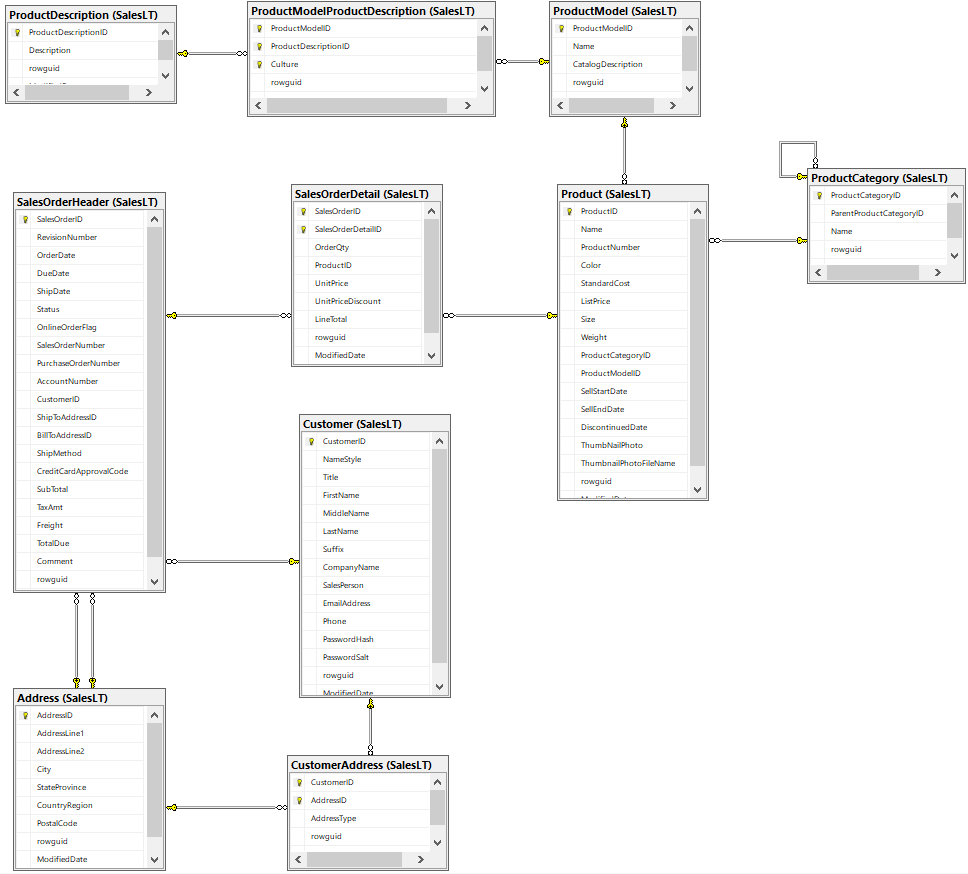

# azure-adventureworks-to-cosmos

The purpose of this GitHub project is to demonstrate an example of how to port a 
**Relational Database** to a **NoSQL CosmosDB** database.  The initial implementation
targets a **CosmosDB/Mongo** database, but CosmosDB/SQL will be added soon.

The database used in this project is the **AdventureWorksLT** database, which can
automatically be created and populated when you create an **Azure SQL** database.

See:
- https://docs.microsoft.com/en-us/sql/samples/adventureworks-install-configure?view=sql-server-ver15&tabs=ssms
- See az CLI script **az/sqldb.sh** (code below) in this repo which provisions an Azure SQL DB.

```
echo 'creating Azure SQL DB database with AdventureWorksLT: '$sqldb_dbname
az sql db create \
    --resource-group $sqldb_rg \
    --server $sqldb_server \
    --name $sqldb_dbname \
    --sample-name AdventureWorksLT \
    --edition GeneralPurpose \
    --family Gen4 \
    --capacity 1 \
    --zone-redundant false \
    > tmp/sqldb_db_create.json
```

### Implementation Notes

- The implementation programming language is Python 3.
- The scripts in this repo are currently implemented in bash for linux and macOS.
- Windows PowerShell scripts will be added in the future.

### Structure of this GitHub Repository

```
.
├── az                   <-- Shell scripts which use the Azure CLI to provision Azure resources
│   └── tmp              <-- Output directory for the az scripts
├── install_scripts      <-- Optional scripts to install pyenv and pyodbc on your system
│   ├── linux
│   └── mac
└── py                   <-- python top-level code
    ├── data             <-- data files
    │   ├── exported     <-- CSV data files exported from Azure SQL AdventureWorksLT DB
    │   └── wrangled     <-- JSON data wrangled from the CSV export files
    ├── tmp              <-- Output directory for the various python processes
```

---

## AdventureWorksLT Sample Database in Azure SQL

### Entity-Relationship Diagram for the AdventureWorksLT SalesLT database

<p align="center"></p>

### The list of tables in the AdventureWorksLT SalesLT database

```
tables = [
  "Address",
  "Customer",
  "CustomerAddress",
  "Product",
  "ProductCategory",
  "ProductDescription",
  "ProductModel",
  "ProductModelProductDescription",
  "SalesOrderDetail",
  "SalesOrderHeader",
]
```

## Setup

### Environment Variables

The code in this reporitory uses the following environment varibles.
You should set these on your system if you wish to execute the code.

USER and AZURE_SUBSCRIPTION_ID should be set before you provision your Azure Resources
as described in the next section.  Set the remaining environment variables after
you provision your Azure SQL Database and your Azure Cosmos/Mongo Database.
See Azure Portal for their values.

```
AZURE_SUBSCRIPTION_ID
USER

AZURE_SQL_SERVER
AZURE_SQL_SERVER_FULL_NAME
AZURE_SQL_DATABASE
AZURE_SQL_USER
AZURE_SQL_PASS

AZURE_COSMOSDB_MONGODB_CONN_STRING
AZURE_COSMOSDB_MONGODB_DBNAME
```

### Provision Azure Resources

cd into directory az/, then edit file **config.sh** with your Azure configuration
information - such as resource group name, region, and DB account names.

Then run these three shell scripts which invoke **az CLI** commands:

```
$ cd az

$ ./sqldb.sh create          <-- create your Azure SQL database with AdventureWorksLT sample
$ ./cosmos_mongo.sh create   <-- create CosmosDB account with Mongo API 
# ./cosmos_sql.sh create     <-- create CosmosDB account with SQL API   (NOT yet used in this repo as of 2021/01/07)
```

### Python Virtual Environment

There are multiple ways to do this, I prefer **pyenv**.
Regardlies of your preferences, do a pip install of the requirements.txt file.

```
$ cd py
$ ./pyenv.sh
```

---

## Export Data and Metadata from the Azure SQL DB

First, we simply the export the contents of each database table to separate CSV files.
We exclude some data (i.e. - binary images) that we can port elsewhere to Azure Blob Storage.

### Execute the data-export process with python (export.sh)

```
$ cd py
$ mkdir tmp

$ ./export_adventureworks_db.sh

export_sample_db_to_csv
driver:    {ODBC Driver 17 for SQL Server}
server_fn: cjoakimazsqlsrv2.database.windows.net
database:  cjoakimazsqldb2
username:  cjoakim
password:  ****************
conn_str: Driver={ODBC Driver 17 for SQL Server};Server=tcp:cjoakimazsqlsrv2.database.windows.net,1433;Database=cjoakimazsqldb2;Uid=cjoakim;Pwd=****************;Encrypt=yes;TrustServerCertificate=no;Connection Timeout=30;
=== sql: exec sp_columns Address
file written: data/exported/table_columns_Address.json
=== sql: exec sp_columns Customer
file written: data/exported/table_columns_Customer.json
=== sql: exec sp_columns CustomerAddress
file written: data/exported/table_columns_CustomerAddress.json
=== sql: exec sp_columns Product
file written: data/exported/table_columns_Product.json
=== sql: exec sp_columns ProductCategory
file written: data/exported/table_columns_ProductCategory.json
=== sql: exec sp_columns ProductDescription
file written: data/exported/table_columns_ProductDescription.json
=== sql: exec sp_columns ProductModel
file written: data/exported/table_columns_ProductModel.json
=== sql: exec sp_columns ProductModelProductDescription
file written: data/exported/table_columns_ProductModelProductDescription.json
=== sql: exec sp_columns SalesOrderDetail
file written: data/exported/table_columns_SalesOrderDetail.json
=== sql: exec sp_columns SalesOrderHeader
file written: data/exported/table_columns_SalesOrderHeader.json
file written: data/exported/table_headers.json
=== sql: SELECT * from [SalesLT].[Address]
file written: data/exported/table_data_Address.csv (451 lines)
=== sql: SELECT * from [SalesLT].[Customer]
file written: data/exported/table_data_Customer.csv (848 lines)
=== sql: SELECT * from [SalesLT].[CustomerAddress]
file written: data/exported/table_data_CustomerAddress.csv (418 lines)
=== sql: SELECT * from [SalesLT].[Product]
file written: data/exported/table_data_Product.csv (296 lines)
=== sql: SELECT * from [SalesLT].[ProductCategory]
file written: data/exported/table_data_ProductCategory.csv (42 lines)
=== sql: SELECT * from [SalesLT].[ProductDescription]
file written: data/exported/table_data_ProductDescription.csv (763 lines)
=== sql: SELECT * from [SalesLT].[ProductModel]
file written: data/exported/table_data_ProductModel.csv (129 lines)
=== sql: SELECT * from [SalesLT].[ProductModelProductDescription]
file written: data/exported/table_data_ProductModelProductDescription.csv (763 lines)
=== sql: SELECT * from [SalesLT].[SalesOrderDetail]
file written: data/exported/table_data_SalesOrderDetail.csv (543 lines)
=== sql: SELECT * from [SalesLT].[SalesOrderHeader]
file written: data/exported/table_data_SalesOrderHeader.csv (33 lines)
done
```

---

## Wrangle the exported CSV data into JSON documents

We could implement the NoSQL database design in a number of ways.
This repo implements it as follows; the design should ultimately be driven by how the data is queried.

Each document created in this wrangling process has two important attributes:
- **doctype** - the type of the document 
- **pk** - the partition key 

### Original List of Tables, and their Document mappings

```
tables = [
  "Address",                          --> Customer
  "Customer",                         --> Customer
  "CustomerAddress",                  --> Customer
  "ProductCategory",                  --> ProductCategory
  "Product",                          --> Product
  "ProductDescription",               --> Product
  "ProductModel",                     --> Product
  "ProductModelProductDescription",   --> Product
  "SalesOrderDetail",                 --> CustomerOrder
  "SalesOrderHeader",                 --> CustomerOrder
]
```

### Document types for NoSQL

#### **Customer** documents

- aggregated from the Customer, Address, and CustomerAddress tables

#### **CustomerOrder** documents

- aggregated from the SalesOrderHeader and SalesOrderDetail tables

#### **ProductCategory** documents

- from the ProductCategory table

#### **Product** documents

- aggregated from the Product, ProductModel, ProductDescription, and ProductModelProductDescription tables


### Execute the data-wrangling process with python (wrangle.sh)

```
$ cd py

$ ./wrangle.sh

gather_table_metadata for table Address
gather_table_metadata for table Customer
gather_table_metadata for table CustomerAddress
gather_table_metadata for table Product
gather_table_metadata for table ProductCategory
gather_table_metadata for table ProductModel
gather_table_metadata for table ProductDescription
gather_table_metadata for table ProductModelProductDescription
gather_table_metadata for table SalesOrderHeader
gather_table_metadata for table SalesOrderDetail
file written: data/wrangled/db_metadata.json
csv_to_json
processing table Address
processing table Customer
processing table CustomerAddress
processing table Product
processing table ProductCategory
processing table ProductModel
processing table ProductDescription
processing table ProductModelProductDescription
processing table SalesOrderHeader
processing table SalesOrderDetail
file written: data/wrangled/db_rows.json
4276 rows read from data/wrangled/db_rows.json
file written: data/wrangled/customers.json
file written: data/wrangled/customer_orders.json
file written: data/wrangled/product_categories.json
file written: data/wrangled/products.json
done
```

#### Example Customer Document

This includes data from the Customer, Address, and CustomerAddress tables.

```
{
    "CompanyName": "Custom Accessories Company",
    "CustomerID": 29601,
    "EmailAddress": "dirk0@adventure-works.com",
    "FirstName": "Dirk",
    "LastName": "Bruno",
    "MiddleName": "J.",
    "NameStyle": "False",
    "PasswordHash": "XaEqG3bH0NhFTn8IBCk4SidcF444Tnvqqr5UjGUiN7E=",
    "PasswordSalt": "DblcZuo=",
    "Phone": "817-555-0114",
    "SalesPerson": "adventure-works\\garrett1",
    "Suffix": "None",
    "Title": "Mr.",
    "addresses": [
      {
        "AddressID": 516,
        "AddressLine1": "251 Indell Lane",
        "AddressLine2": "None",
        "AddressType": "Main Office",
        "City": "Brampton",
        "CountryRegion": "Canada",
        "PostalCode": "L6W 2T7",
        "StateProvince": "Ontario",
        "rowguid": "A1F36994-B5B3-4646-87EA-692A513395EA"
      }
    ],
    "doctype": "customer",
    "pk": 29601,
    "rowguid": "18BCB5D4-14FB-4AF6-A8C2-AF791B677F6C"
}
```

#### Example Product Document

This includes data from the Product, ProductDescription, ProductModel, and 
ProductModelProductDescription tables.

```
{
  "Color": "Black",
  "Descriptions": {
    "ar": "...",
    "en": "The ML frame is a heat-treated aluminum frame made with the same detail and quality as our HL frame. It offers superior performance. Men's version.",
    "fr": "Le cadre ML est un cadre en aluminium trait ...",
    "he": "...",
    "th": "...",
    "zh-cht": "..."
  },
  "DiscontinuedDate": "None",
  "ListPrice": 348.76,
  "Name": "ML Mountain Frame - Black, 38",
  "ProductCategoryID": 16,
  "ProductID": 814,
  "ProductModelID": 15,
  "ProductModelName": "ML Mountain Frame-W",
  "ProductNumber": "FR-M63B-38",
  "SellEndDate": "2007-06-30 00:00:00",
  "SellStartDate": "2006-07-01 00:00:00",
  "Size": "38",
  "StandardCost": 185.8193,
  "ThumbNailPhoto": "product_814.gif",
  "ThumbnailPhotoFileName": "no_image_available_small.gif",
  "Weight": "1238.30",
  "doctype": "product",
  "pk": 814,
  "rowguid": "0D879312-A7D3-441D-9D23-B6550BAB3814"
}
```

---

## Load the Documents into Collections/Containers in CosmosDB

Again, there are multiple ways to do this based on your use-cases.
Here are three ways to do it:

### Design A

```
Document Type                         Container
-------------                         ---------
Customer                              Customer
CustomerOrder                         CustomerOrder
Product                               Product
ProductCategory                       ProductCategory
```

### Design B

In this design, it's possible to fetch a Customer and their Orders in one query,
if the Order pk is the Customer pk.

```
Document Type                         Container
-------------                         ---------
Customer                              Customer
CustomerOrder                         Customer
Product                               Product
ProductCategory                       Product
```

### Design C

Yes, it's possible to put all of the documents into one container.
Use a well-distributed pk, and query by doctype.

```
Document Type                         Container
-------------                         ---------
Customer                              Data
CustomerOrder                         Data
Product                               Data
ProductCategory                       Data
```

### Design R

CosmosDB is a NoSQL database and there is no need to port a relational database
with a 1:1 correlation between relational tables and NoSQL containers.

**Please don't do this.  It's expensive and inefficient.**

```
Table                                 Document Type and Container
-------------                         ---------------------------

tables = [
  "Address",                          --> Address
  "Customer",                         --> Customer
  "CustomerAddress",                  --> CustomerAddress
  "ProductCategory",                  --> ProductCategory
  "Product",                          --> Product
  "ProductDescription",               --> ProductDescription
  "ProductModel",                     --> ProductModel
  "ProductModelProductDescription",   --> ProductModelProductDescription
  "SalesOrderDetail",                 --> SalesOrderDetail
  "SalesOrderHeader",                 --> SalesOrderHeader
]
```

### Execute the Cosmos/Mongo data-loading process with python (cosmos_mongo.sh)

```
$ cd py

$ ./cosmos_mongo.sh load_db design_a
  - or -
$ ./cosmos_mongo.sh load_db design_b
  - or -
$ ./cosmos_mongo.sh load_db design_c
```

---

## Mongo Command-Line tools

These work with Azure CosmosDB.  For example, open a mongo shell to CosmosDB with this command
which uses your AZURE_COSMOSDB_MONGODB_CONN_STRING environment variable.

```
$ cd py

$ ./mongo_cli.sh azure

...
MongoDB server version: 3.6.0
globaldb:PRIMARY> use dev
switched to db dev
globaldb:PRIMARY> show collections
Customer
CustomerOrder
Data
Product
ProductCategory
```

---

## Reference

- [CosmosDB](https://azure.microsoft.com/en-us/services/cosmos-db/)
- [CosmosDB/Mongo Introduction](https://docs.microsoft.com/en-us/azure/cosmos-db/mongodb-introduction)
- [CosmosDB/Mongo 3.6 Feature Support](https://docs.microsoft.com/en-us/azure/cosmos-db/mongodb-feature-support-36)
- [pymongo python library](https://pypi.org/project/pymongo/)

### Migration

- [Migration Choices](https://docs.microsoft.com/en-us/azure/cosmos-db/cosmosdb-migrationchoices)
- [Azure Database Migration Service](https://docs.microsoft.com/en-us/azure/dms/tutorial-mongodb-cosmos-db?toc=/azure/cosmos-db/toc.json)
- [Azure Data Factory](https://docs.microsoft.com/en-us/azure/data-factory/connector-mongodb)
- [mongoexport](https://docs.mongodb.com/manual/reference/program/mongoexport/) and [mongoimport](https://docs.mongodb.com/manual/reference/program/mongoimport/)
- [mongodump](https://docs.mongodb.com/manual/reference/program/mongorestore/) and [mongoimport](https://docs.mongodb.com/manual/reference/program/mongorestore/)
- Simple application code as shown in this repo - export, wrangle, load

