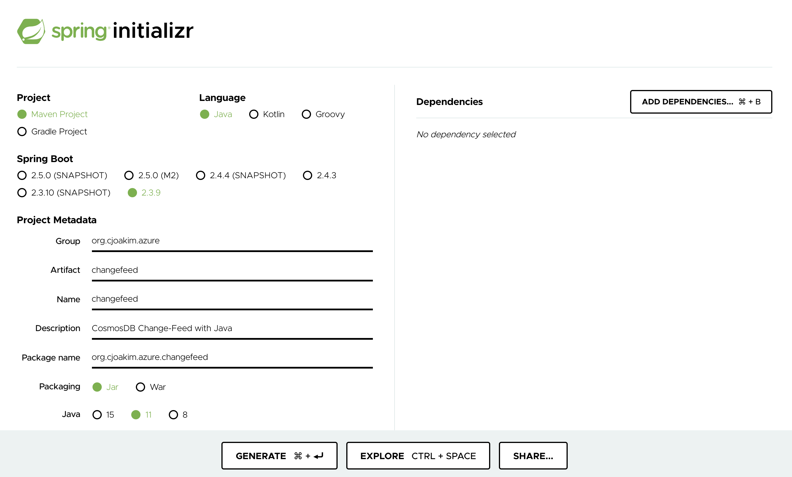

# Bootstrapping this Project

Documenting this, because I'll surely forget these steps for the next project.  ;-)

### Start with a Spring Boot Minimal Project 

Visit https://start.spring.io/ and specify values similar to the following image
in the UI of the page.  Note that I intentionally selected no dependencies so as
to create a minimal [Spring Boot](https://spring.io/projects/spring-boot) 
application to build upon. 

<p align="center"></p>

Download the zip file from https://start.spring.io/ and unzip it in the root of the git repo.

Edit the entry-point class, ChangefeedApplication, to implement **CommandLineRunner** and add a run() method.

```
package org.cjoakim.azure.changefeed;

import org.springframework.boot.CommandLineRunner;
import org.springframework.boot.SpringApplication;
import org.springframework.boot.autoconfigure.SpringBootApplication;

@SpringBootApplication
public class ChangefeedApplication implements CommandLineRunner {

	public static void main(String[] args) {
		SpringApplication.run(ChangefeedApplication.class, args);
	}

	@Override
    public void run(String... args) throws Exception {
    	System.out.println("TODO - Implement Program Logic!");
    }
}
```

## Add the Azure CosmosDB Client Library for Java

- See https://docs.microsoft.com/en-us/java/api/overview/azure/cosmos-readme?view=azure-java-stable
- See https://search.maven.org/

Edit the pom.xml file in the project, add the following:

```
<!-- https://mvnrepository.com/artifact/com.azure/azure-cosmos -->
<dependency>
    <groupId>com.azure</groupId>
    <artifactId>azure-cosmos</artifactId>
    <version>4.13.0</version>
</dependency>
```

## Logging

Add entries in **application.properties** like this:

```
# Logging
logging.level.root=warn
logging.level.org.cjoakim.azure.changefeed=debug

```

See https://docs.spring.io/spring-boot/docs/2.1.13.RELEASE/reference/html/boot-features-logging.html


