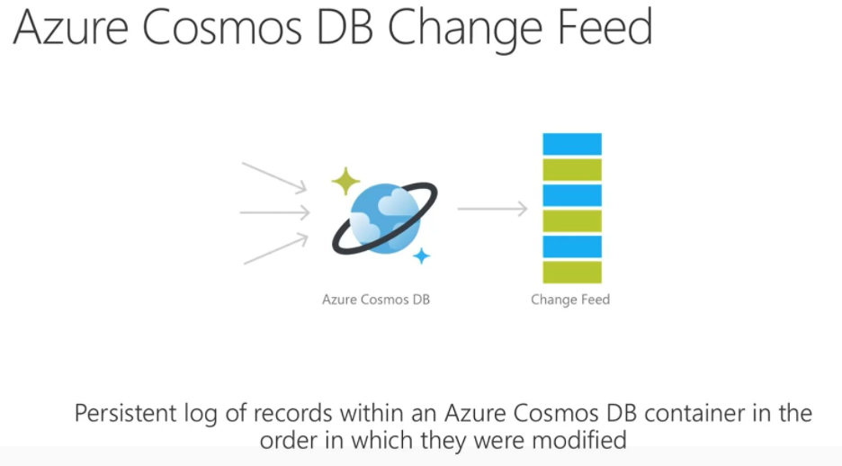

# azure-cosmosdb-changefeed

Examples of consuming the CosmosDB change-feed

---

## What is the Change Feed?

---

## Links

- https://docs.microsoft.com/en-us/azure/cosmos-db/change-feed
- https://docs.microsoft.com/en-us/azure/cosmos-db/change-feed-pull-model

## Implementations in this repo

- **Java with CosmosDB/SQL API** - see the java/cosmos_sql/ directory
- **DotNet** - coming soon
- **Functuons** - coming soon
