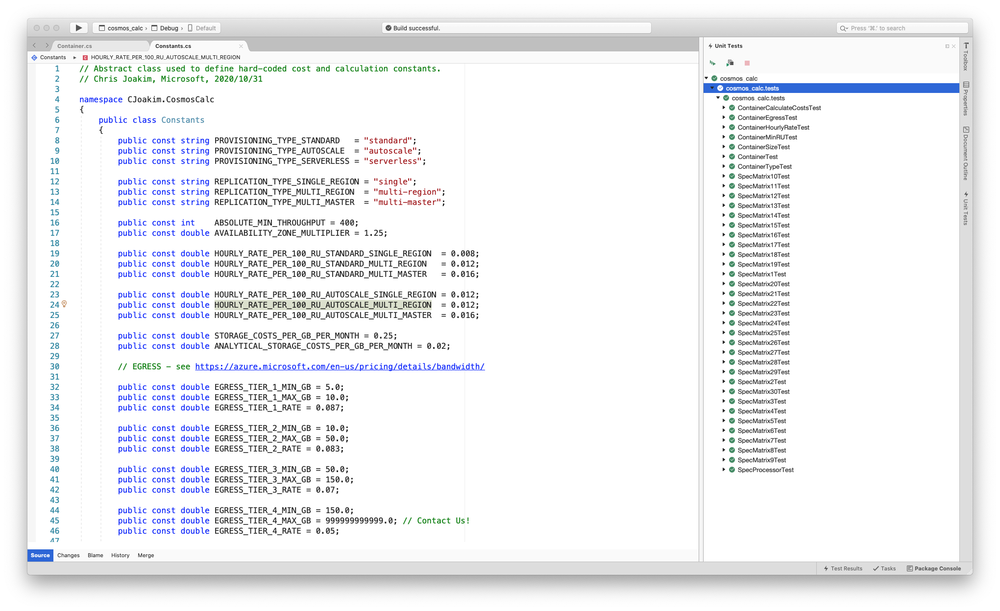

# azure-cosmosdb-cost-calculator

Calculate CosmosDB costs using DotNet Core code and a "Cucumber-like" specification syntax.

You **do not** have to modify the code; just create specification file(s)
for your particular use-cases.

### Wait, what is Cucumber?

It's a software testing framework that allows you to express tests
in an English-like syntax of your own creation, see  
[Cucumber](https://en.wikipedia.org/wiki/Cucumber_(software)).

---

## Getting Started

This calculator assumes that you have [git](https://git-scm.com/) and 
[DotNet Core 3.1](https://dotnet.microsoft.com/download/dotnet-core) 
installed on your system.

If so, then execute the following commands in a Terminal/PowerShell window.

```
$ git clone https://github.com/cjoakim/azure-cosmosdb-cost-calculator.git
$ cd azure-cosmosdb-cost-calculator 
$ cd cosmos_calc
$ dotnet restore
$ dotnet build
```

---

## The "Specification Language" used by this Calculator

This syntax is inspired by the Cucumber testing tool, though the
implementation of this calculator does not use cucumber.

The idea is to express your CosmosDB container specification in an English-like
syntax, then let the code perform the calculations given **your specification file**.

```
Statement                    Values
---------                    ------
container:                   Your container name or use-case name
provisioning_type:           standard (default) or autoscale
replication_type:            single (default), multi-region, or multi-master
ru_per_second:               The number of RUs in the container
region_count:                The number of regions, defaults to 1
availability_zone:           Boolean, defaults to false
size_in_bytes:               Specify the storage quantity in terms of bytes
size_in_mb:                  Specify the storage quantity in terms of MB
size_in_gb:                  Specify the storage quantity in terms of GB
size_in_tb:                  Specify the storage quantity in terms of TB
size_in_pb:                  Specify the storage quantity in terms of PB
max_historical_manual_ru:    Optional
max_historical_auto_ru:      Optional
replicated_gb_per_month:     The number of GB replicated per month from one region
synapse_link_enabled:        Boolean, defaults to false
calculate_costs:             boolean, triggers a Cost calculation if true
```


## Usage - Example 1

First, define your CosmosDB databases/container specifications in a **Cucumber-like** 
text file like the following.  This example will produce cost calculations for
the **four** containers in the specification file.

```
Sample Costs Specification #1
This file is passed to Program.cs

container:                   events1
provisioning_type:          standard
replication_type:             single
region_count:                      1
size_in_gb:                        1
max_historical_manual_ru:       1000
max_historical_auto_ru:            0
ru_per_second:                   500
availability_zone:             false
synapse_link_enabled:          false
calculate_costs:                true

container:                   events2
provisioning_type:          standard
replication_type:             single
region_count:                      1
size_in_gb:                        1
max_historical_manual_ru:       1000
max_historical_auto_ru:            0
ru_per_second:                   500
availability_zone:              true
synapse_link_enabled:           true
calculate_costs:                true

container:              assignment1a
provisioning_type:          standard
replication_type:             single
region_count:                      1
size_in_tb:                        1
max_historical_manual_ru:          0
max_historical_auto_ru:            0
ru_per_second:                200000
availability_zone:             false
calculate_costs:                true

container:                replicated
provisioning_type:          standard
replication_type:             single
region_count:                      2
size_in_tb:                       10
max_historical_manual_ru:          0
max_historical_auto_ru:            0
ru_per_second:                100000
availability_zone:             false
synapse_link_enabled:           true
calculate_costs:                true
```

Then execute Program.cs, passing the name of the text specification file:

```
$ dotnet run specification1.txt
```

The output is in JSON format, and contains both the specification values
for each container as well as the calculated costs for it.  The attributes
in the JSON which begin with "calculated" are calculated by the program.

```
{
  "name": "events1",
  "sizeInGB": 1,
  "provisioningType": "standard",
  "availabilityZone": false,
  "synapseLinkEnabled": false,
  "replicationType": "single",
  "regionCount": 1,
  "ruPerSecond": 500,
  "maxHistoricalManualRu": 1000,
  "maxHistoricalAutoRu": 0,
  "replicatedGBPerMonth": 0,
  "calculatedMinRU": 400,
  "calculatedRatePer100RU": 0.008,
  "calculatedRUInHundreds": 5,
  "calculatedRuDollarsPerHour": 0.04,
  "calculatedRuDollarsPerMonth": 29.12,
  "calculatedEgressPerMonth": 0,
  "calculatedStoragePerMonth": 0.25,
  "calculatedAnalyticalStoragePerMonth": 0,
  "calculatedTotalPerMonth": 29.37
}
{
  "name": "events2",
  "sizeInGB": 1,
  "provisioningType": "standard",
  "availabilityZone": true,
  "synapseLinkEnabled": true,
  "replicationType": "single",
  "regionCount": 1,
  "ruPerSecond": 500,
  "maxHistoricalManualRu": 1000,
  "maxHistoricalAutoRu": 0,
  "replicatedGBPerMonth": 0,
  "calculatedMinRU": 400,
  "calculatedRatePer100RU": 0.01,
  "calculatedRUInHundreds": 5,
  "calculatedRuDollarsPerHour": 0.05,
  "calculatedRuDollarsPerMonth": 36.4,
  "calculatedEgressPerMonth": 0,
  "calculatedStoragePerMonth": 0.25,
  "calculatedAnalyticalStoragePerMonth": 0.02,
  "calculatedTotalPerMonth": 36.67
}
{
  "name": "assignment1a",
  "sizeInGB": 1024,
  "provisioningType": "standard",
  "availabilityZone": false,
  "synapseLinkEnabled": false,
  "replicationType": "single",
  "regionCount": 1,
  "ruPerSecond": 200000,
  "maxHistoricalManualRu": 0,
  "maxHistoricalAutoRu": 0,
  "replicatedGBPerMonth": 0,
  "calculatedMinRU": 10300,
  "calculatedRatePer100RU": 0.008,
  "calculatedRUInHundreds": 2000,
  "calculatedRuDollarsPerHour": 16,
  "calculatedRuDollarsPerMonth": 11648,
  "calculatedEgressPerMonth": 0,
  "calculatedStoragePerMonth": 256,
  "calculatedAnalyticalStoragePerMonth": 0,
  "calculatedTotalPerMonth": 11904
}
{
  "name": "replicated",
  "sizeInGB": 10240,
  "provisioningType": "standard",
  "availabilityZone": false,
  "synapseLinkEnabled": true,
  "replicationType": "single",
  "regionCount": 2,
  "ruPerSecond": 100000,
  "maxHistoricalManualRu": 0,
  "maxHistoricalAutoRu": 0,
  "replicatedGBPerMonth": 0,
  "calculatedMinRU": 102400,
  "calculatedRatePer100RU": 0.008,
  "calculatedRUInHundreds": 1000,
  "calculatedRuDollarsPerHour": 8,
  "calculatedRuDollarsPerMonth": 5824,
  "calculatedEgressPerMonth": 0,
  "calculatedStoragePerMonth": 5120,
  "calculatedAnalyticalStoragePerMonth": 204.8,
  "calculatedTotalPerMonth": 11148.8
}
```

---

## This Project in Visual Studio

Xunit unit tests are included in this project.

<p align="center" width="95%">
  
</p>

### Executing the unit tests outside of Visual Studio

```
$ cd cosmos_calc.tests/
$ dotnet test
...
Passed!  - Failed:     0, Passed:    97, Skipped:     0, Total:    97, Duration: 195 ms
...
```

### Executing the unit tests outside of Visual Studio, with Coverage

On linux, macOS, or Windows 10 with WSL:

```
$ ./run_tests.sh
```

Then open file coveragereport/index.html in your browser.

---

## Test Specification Matrix

Bash script **execute_spec_matrix.sh** executes the **matrix** of combinations
shown in the table below.

### Key

- Prov = Provisioning Type
- Repl = Replication Type
- RC = Region Count
- AvZ = Availability Zone
- DB GB = Size of the database contents in Gigabytes
- Spec File = the cost calculator specification file in directory **cosmos_calc/spec_matrix/**

### Table

| Prov | Repl | RC | AvZ | DB GB | Spec File |
| ---- | ---- | -- | --- | ----- | --------- |
| standard | single | 1 | azone | 3 | 1-standard-single-1-azone-3gb.txt |
| standard | single | 1 | azone | 300 | 2-standard-single-1-azone-300gb.txt |
| standard | single | 1 | azone | 30000 | 3-standard-single-1-azone-30000gb.txt |
| standard | single | 1 | noazone | 3 | 4-standard-single-1-noazone-3gb.txt |
| standard | single | 1 | noazone | 300 | 5-standard-single-1-noazone-300gb.txt |
| standard | single | 1 | noazone | 30000 | 6-standard-single-1-noazone-30000gb.txt |
| standard | multi-region | 3 | noazone | 3 | 7-standard-multi-region-3-noazone-3gb.txt |
| standard | multi-region | 3 | noazone | 300 | 8-standard-multi-region-3-noazone-300gb.txt |
| standard | multi-region | 3 | noazone | 30000 | 9-standard-multi-region-3-noazone-30000gb.txt |
| standard | multi-master | 3 | azone | 3 | 10-standard-multi-master-3-azone-3gb.txt |
| standard | multi-master | 3 | azone | 300 | 11-standard-multi-master-3-azone-300gb.txt |
| standard | multi-master | 3 | azone | 30000 | 12-standard-multi-master-3-azone-30000gb.txt |
| standard | multi-master | 3 | noazone | 3 | 13-standard-multi-master-3-noazone-3gb.txt |
| standard | multi-master | 3 | noazone | 300 | 14-standard-multi-master-3-noazone-300gb.txt |
| standard | multi-master | 3 | noazone | 30000 | 15-standard-multi-master-3-noazone-30000gb.txt |
| autoscale | single | 1 | azone | 3 | 16-autoscale-single-1-azone-3gb.txt |
| autoscale | single | 1 | azone | 300 | 17-autoscale-single-1-azone-300gb.txt |
| autoscale | single | 1 | azone | 30000 | 18-autoscale-single-1-azone-30000gb.txt |
| autoscale | single | 1 | noazone | 3 | 19-autoscale-single-1-noazone-3gb.txt |
| autoscale | single | 1 | noazone | 300 | 20-autoscale-single-1-noazone-300gb.txt |
| autoscale | single | 1 | noazone | 30000 | 21-autoscale-single-1-noazone-30000gb.txt |
| autoscale | multi-region | 3 | noazone | 3 | 22-autoscale-multi-region-3-noazone-3gb.txt |
| autoscale | multi-region | 3 | noazone | 300 | 23-autoscale-multi-region-3-noazone-300gb.txt |
| autoscale | multi-region | 3 | noazone | 30000 | 24-autoscale-multi-region-3-noazone-30000gb.txt |
| autoscale | multi-master | 3 | azone | 3 | 25-autoscale-multi-master-3-azone-3gb.txt |
| autoscale | multi-master | 3 | azone | 300 | 26-autoscale-multi-master-3-azone-300gb.txt |
| autoscale | multi-master | 3 | azone | 30000 | 27-autoscale-multi-master-3-azone-30000gb.txt |
| autoscale | multi-master | 3 | noazone | 3 | 28-autoscale-multi-master-3-noazone-3gb.txt |
| autoscale | multi-master | 3 | noazone | 300 | 29-autoscale-multi-master-3-noazone-300gb.txt |
| autoscale | multi-master | 3 | noazone | 30000 | 30-autoscale-multi-master-3-noazone-30000gb.txt |

### Executing the Spec Matrix

```
$ cd cosmos_calc

$ dotnet build

$ dotnet run spec_matrix/28-autoscale-multi-master-3-noazone-3gb.txt   <-- run one of the specs

$ ./execute_spec_matrix.sh     <-- executes all 30 specs in the matrix, see the spec_matrix/out directory
```

cosmos_calc/spec_matrix

### Generator Code

The python code in directory **spec_generator** was used to generate these spec files and 
corresponding C# Xunit files.  This code requires that environment variable
**AZURE_COSMOSDB_COST_CALCULATOR_HOME** is set on your system to the root of the GitHub repository.

---

## Change Log

### What's New

- 2021/01/06: Upgraded project from **netcoreapp3.1** to **net5.0**
- Text Specification Matrix for use-case and code coverage
- Synapse Link Storage Costs
- Cross-region Egress Costs
- Magic numbers (hourly rates, egress tiers, storage costs, etc.) extracted to class Constants
- Code Coverage in the Unit Tests - 100% coverage of classes Container and SpecProcessor

---

## CosmosDB Cost Links

- https://cosmos.azure.com/capacitycalculator/
- https://azure.microsoft.com/en-us/pricing/details/cosmos-db/
- https://docs.microsoft.com/en-us/azure/cosmos-db/understand-your-bill
- https://azure.microsoft.com/en-us/pricing/calculator/
